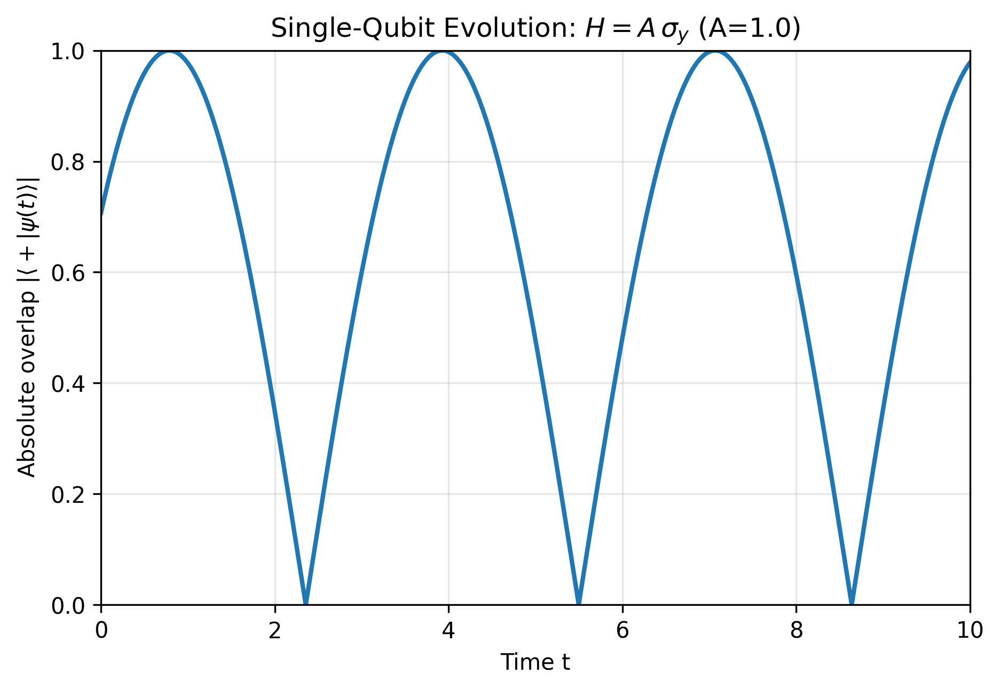
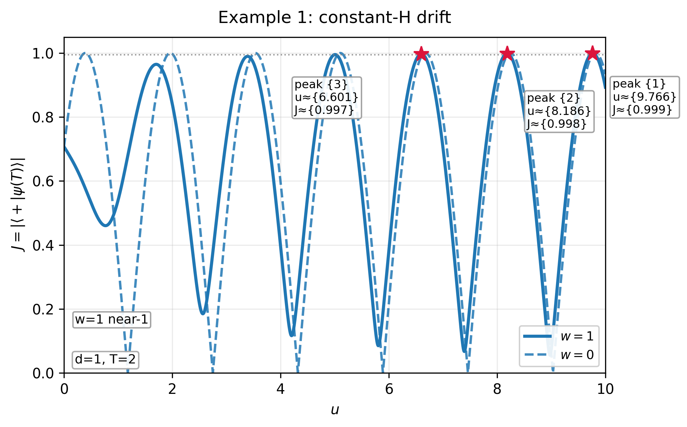
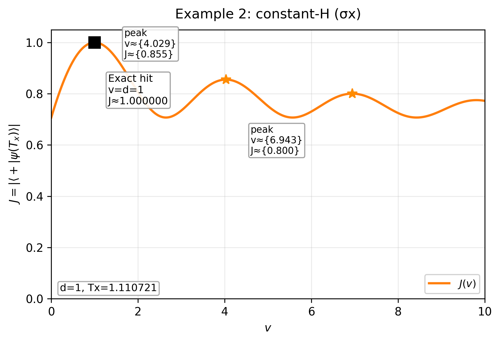
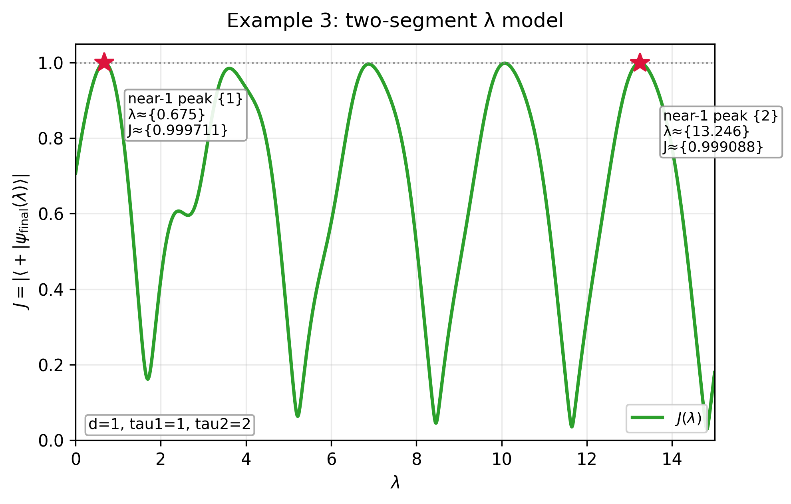

# First contact (2^nd^ September 2026)

This week I was given access to the Theo Platform beta product (known as Collaborator for the beta), 
which is a web application driven through an AI chat interface. Along the way, one collects artifacts, such as code files. We’ll see this develop as we go.

## **Onboarding**

After log in and password selection, there is some short onboarding process where Theo matches you with some online profile. I only had to give my name and institution and it found my existing research publications etc and made a very nice summary of my research work to date. The process was very quick and smooth. After this I was invited to start my first session.

## **Session \#1 – Quantum Control Landscapes**

This idea is based on an undergraduate student project from 2024\. The idea here is to repeat and extend the project, with permission of the Student, [William Townsend](https://www.aber.ac.uk/en/maths/staff-profiles/listing/profile/wit12), who is now a PhD candidate here at Aberystwyth. Will made good progress on his project, but we needed to go a little further in order to make a good publication. The plan is to see if Theo can find the same results, perhaps a little quicker, and extend into some new results.

The basic premise of the project is that through gaining some mathematical understanding of the optimisation landscape for quantum control parameters, one might more efficiently locate local extrema and hence find potential global extrema more efficiently. The typical approach assumes a smooth manifold in a multi-dimensional space and uses gradient descent to find local minima starting from some random point in the space. The first local minimum encountered, may not be the global minimum. If not, then it is a *local trap*. My assumption is that due to the wave-like nature of quantum mechanics, then we should expect some periodicity in the manifold. So, if one finds one minimum then others might be expected at regular intervals is some dimension, whereas one travels along troughs in others.

So, I explained the idea to Theo, being completely honest that I was making an evaluation, giving not much detail, just that we were going to investigate local traps and try to understand the landscape so as to avoid them. It’s been a while since I worked on this idea, so I asked Theo if it was still relevant. It went away and completed a literature search. We could have continued chatting, but I had a few other things to do. The review was completed in a few minutes and Theo made a nice summary, showing clearly that they understood the problem. I noted how much quicker this was than if I was working with a new student, who would have had to go away and read before we could make more progress. Most importantly, Theo declared that the idea still seemed relevant, mentioning some fairly recent work by well-known people. And so we moved on.

I then mentioned that I was specifically interested in how it could use qutip in working on these problems. It promised to remember and at each step comment on how suitable and effective qutip would be for each task. The first of these was to consider a very simple 1-d system: a qubit driven at a constant rate by $\sigma_y$ with target of transitioning from the exited state |0\> to the superposition state |+\>. Note, this is exactly solvable and only of interest as an illustration, but it proved to be a good test of Theo’s Python coding and use of qutip. 

Specifically, I asked Theo to plot the fidelity the current state against |+\> over time. It made some useful suggestions regarding time range and resolution and I chose one of the options. True to their promise, Theo declared qutip would be useful in this task but they were unsure if it would be available in the environment, so it made a conditional import with fall back to NumPy if qutip is not available. Note, its fallback was based on the analytic solution, so this could get interesting when we look at problems that are not exactly solvable. 

So, we ran the code (server side) and found qutip not available in the environment, so a plot was produced from the NumPy exact solution code (see below). This seemed to be as expected, with the fidelity periodically reaching maximum (1). I then downloaded the code to my machine and ran it there. Initially there was some small error: some obscure method of finding the fidelity, which may have worked in old qutip versions. After a few back and forths, and an interesting discussion on whether the overlap value should be squared or not, we got to a working version and this did indeed produce the same output. I wonder whether Theo would have been able to fix this bug itself if it could have run the qutip version of the code itself?



This example has no traps. Next we’re going to move on to a 1-d example that does have traps – in fact I’m going to ask Theo to suggest a way to modify the Hamiltonian so that it does. Then on to some 2-d examples. This was as far as Will got, extending to many dimensions is when it becomes interesting, as actual interesting science problems have a great many.

I suggested that we could add a drift term in $\sigma_z$ and that this might result in suboptimal local maxima (traps). 
It extended the code and after some iterations we came up with the following plot. 
.


Here we can clearly see that with the drift term applied $w=1$, that the target state is never achieved ($J=1$) but with increasing $\sigma_y$ amplitude $u$ we do approach it for some fixed evolution time, whereas with no drift the target is achieved periodically in $u$.

I checked with Will’s report and found we actually focussed on driving $\sigma_x$ with the $\sigma_z$ drift, so I asked Theo to construct the same example and we got this plot, which matches exactly what Will produced.



This example is interesting because it has an exact hit for some $v$, the coefficient of $\sigma_x$, but then local traps thereafter.

We note that these plots are fairly tidy, but not quite publication quality, as the annotations and legends are oddly placed. This seems at odds with experiences of others with frontier AI models. At this stage, the beta version had only GPT 5.5 (although the default in 5.4 as it’s faster), GLM and Kimi. In recent days, Claude Sonnet and Opus have been added, they may have done a little better. I experimented (far from exhaustively) for some time with the other three and found GLM to be the most reliable at Python coding. It is clear that FP have plans for making the frontier models available in the Platform, but it is also well known that these cost a lot more to run, so somehow this will need to be paid for, but we would expect them to be the release version. The available models are doing amazing work and my focus is to trial this integrated environment. These plots are clearly good enough for our purpose here and they were produced with very little effort from me. I have not edited the code manually at all, though it is possible to do this by mounting the code locally, which I am yet to test.

I felt sure that a 1-d example must exist that contains multiple exact hits with local traps between. I asked Theo to try various options, which it did, but it kept suggesting some alternative that I felt was over-complicated. Eventually, I decided to just straight ask Theo to come up with the example I wanted: given a qubit driven with the three Pauli basis axes, 
i.e $H = u \sigma_x + v \sigma_y + w \sigma_z$ for some time $T$, parameterised by $u, v, w, T$, where 3 are fixed and 1 variable, find an example like the one described.
I thought this was a pretty challenging thing for it to comprehend, but actually it got it immediately and then proved mathematically that it did not exist \- pretty mind blowing for me. So I gave in and accepted its minimal divergence from my demand by having a 2 slot piecewise constant drive in one parameter. Here’s what it came up with.



It is not exactly what I had in mind, because really I wanted to see a dual periodicity, but it does show (at least very close to) multiple exact hits and a local trap.

::: {.callout-note collapse="true"}
### Click to see Python script that produces the 3 example plots
```{.python include="qubit_ctrl_land_1d-v38.py"}
```
:::

I thought that what we have achieved is already fairly interesting, so thought it would be useful to produce some structured notes, including all the maths clearly laid out. I asked Theo to do this and it did produce some TeX code, but it wasn’t really what I was expecting, which was something more like an artifact I could work on interactively. I know that Theo can do this from my experiences working with Randy Davila using Theo Discovery (fka Theo Conjecture), so I thought I would watch the [Theo Collaborator Webinar](https://drive.google.com/file/d/1zMbXe3I8JpHLentXPBYNkVlKPiPMczqy/view?usp=drive_link). This was extremely helpful and discovered how to create other artifacts (than code). I felt a little foolish for not having done this previously.

So what I wanted was a Dynamic Research Object (DRO) but to get there we need to create a few other artifacts. Firstly, going back to Problem Identification, I tried a Council of GLM, Kimi and Claude. All three were able to recognise the gap in the literature and proposed sensible ways forward. Some differences: Kimi most concise, Claude most impressive sounding and a detailed plan of how to achieve the objective. On reflection, it seems my usage so far was not incorrect, because all the Agents referred to the work we had done so far when proposing research questions. I will next ask Claude to help formalise the Research Question.

I am now quite excited about the potential research outcome of this project, as this is something I have believed has potential for a very long time, but not really had the time and resources to pursue. The encouragement from Theo, with confirming a clear gap in the literature and suggesting the research path that I had planned but with added granularity in the steps, spurs me on. The fact that I have an excellent mathematician at my side is also very encouraging.

# Breaking news (30^th^ September 2026) -- Version 1.0 released.

The first full version of the Theo Platform was released late (for me) yesterday.
Expect another post very soon describing what has changed.

